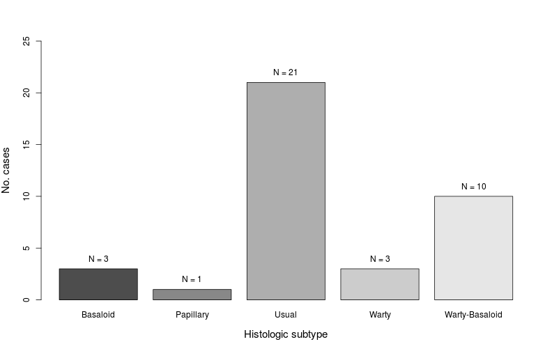
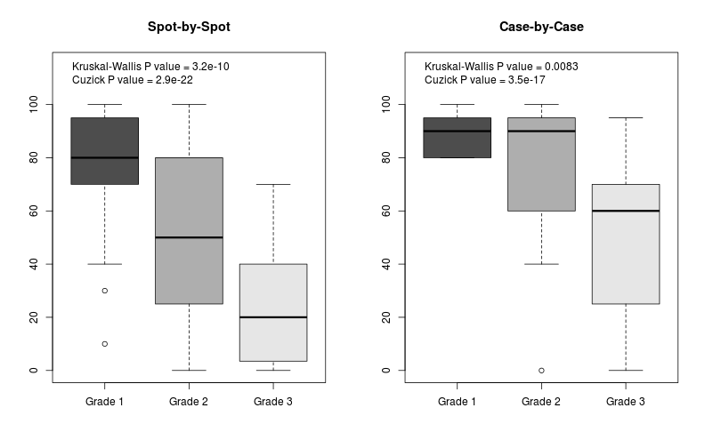
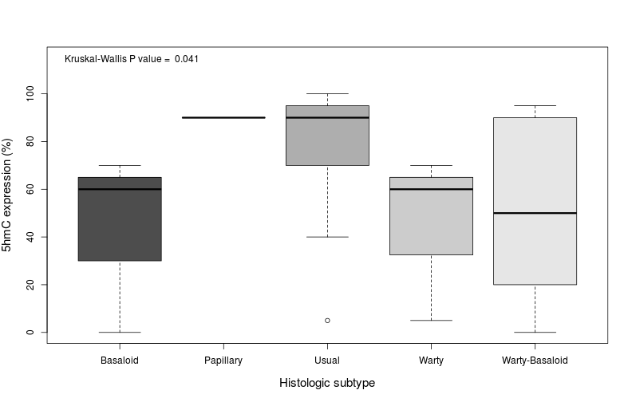
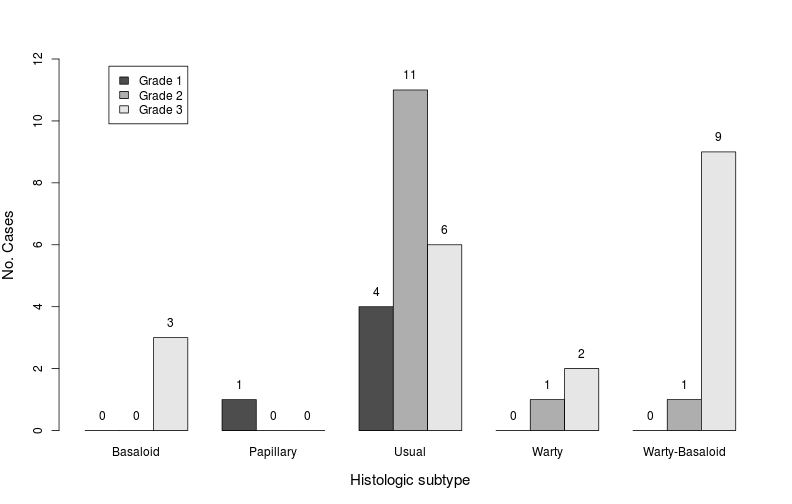
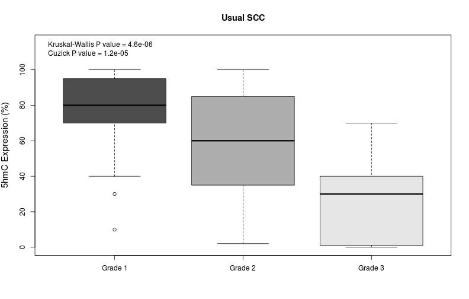
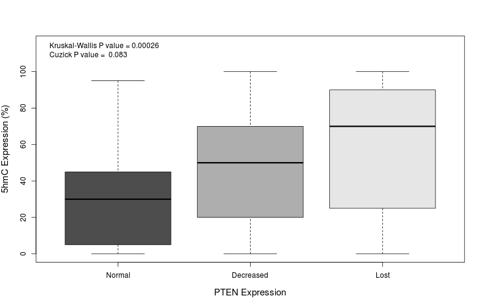
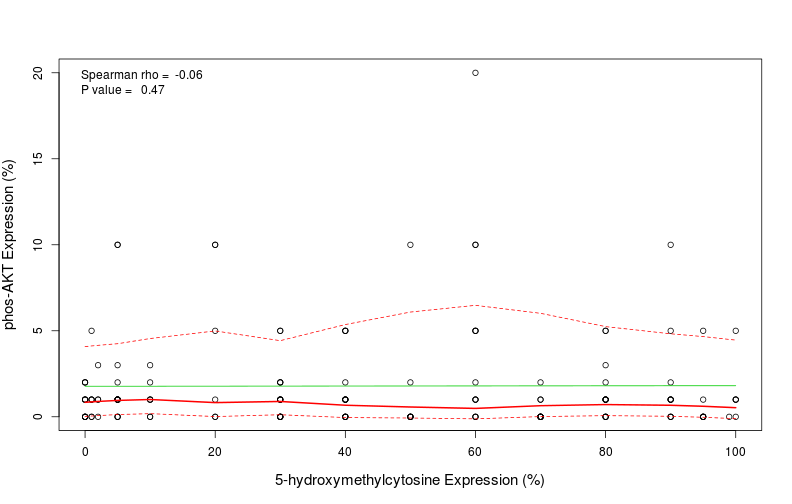
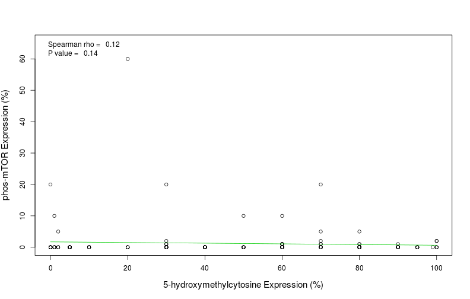
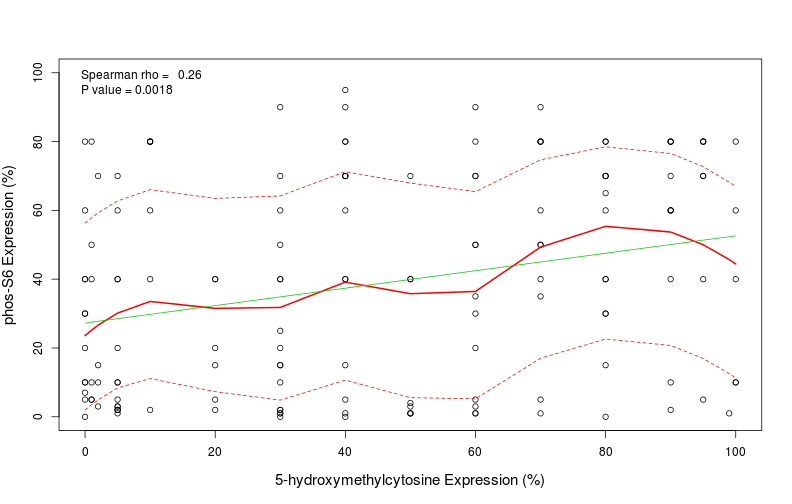
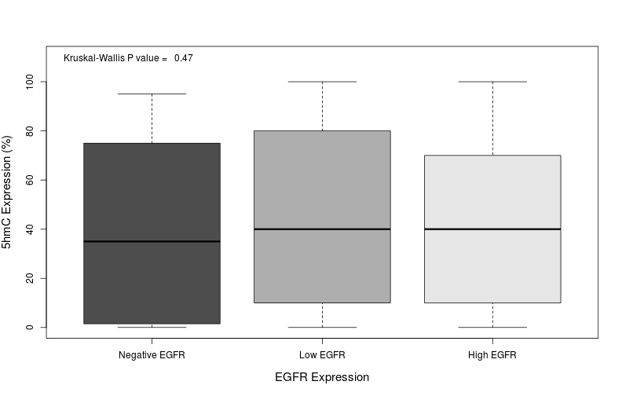

# 5-hydroxymethylcytosine in Penile Cancer

__Project:__ "5-Hydroxy-Methyl-Cytosine Content is Strongly Associated with Degree of Histological Differentiation in Penile Squamous Cell Carcinomas"

__List of Authors:__ Michael C. Haffner, MD, PhD; George J. Netto, MD; Cesar Aponte, BS; Kristen L. Lecksell, BS; William G. Nelson MD, PhD; Srinivasan Yegnasubramanian MD, PhD; Alcides Chaux, MD

***

## ABSTRACT
__Background:__ Cytosine methylation represents an important epigenetic modification that plays a crucial role in normal differentiation as well as carcinogenesis. Recent evidence suggests that methylated cytosine (5mC) can become oxidized to 5-hydroxymethylcytosine (5hmC) in mammalian genome. We have recently shown that global 5hmC levels are greatly reduced in invasive adenocarcinoma. Here we evaluate the status of 5hmC in squamous cell carcinoma of the penis and explore the association of 5hmC with the degree of tumor differentiation.

__Design__: Thirty-eight formalin-fixed paraffin-embedded archival cases of penile squamous cell carcinoma were selected to build a tissue microarray (TMA). Each tumor was sampled 3-9 times. TMA spots were scanned using the APERIO system and uploaded to the TMAJ platform (http://tmaj.pathology.jhmi.edu). In total, 147 individual TMA spots were evaluated. Histological grade was assigned in each spot. Global 5hmC levels were assessed using a 5hmC specific antibody and standard immunohistochemical techniques, as previously described. Extent of 5hmC expression was estimated in each spot as a percentage of positive cells. Correlation between 5hmC and other biomarkers (EGFR and members of the mTOR pathway) was also evaluated. Association between 5hmC extent and histologic grade and subtype was evaluated by the Kruskal-Wallis test and trends were confirmed using Cuzick's test. Correlation was evaluated using the Spearman rank correlation test.

__Results:__ In invasive tumors, extent of 5hmC expression showed a strong association with tumor differentiation, decreasing with increasing histologic grade. Differences were significant (Kruskal-Wallis P < 0.01), as well as trend across ordered categories (Cuzick P < 0.0001). This association seems to be independent of histologic subtype. Addtionally, an inverse and significant association was observed between PTEN expression and 5hmC expression, as well as a positive weak but significant correlation between phos-S6 and 5hmC expression.

__Conclusion:__ In penile squamous cell carcinomas, global 5hmC levels significantly decrease with increased histologic grade. Our finding suggests that alterations in 5hmC expression are associated with carcinogenesis and are inversely correlated with tumor differentiation in penile squamous cell carcinoma.

***

## INTRODUCTION
* Epigenetic modifications play a crucial role in cellular differentiation and have been implicated in numerous disease states including cancer.

* One of the most studied of these modifications is the addition of a methyl group on the 5-position of the cytosine (5-methylcytosine) base in a CpG dinucleotide. 

* We have previously shown that global 5-hydroximethylcytosine (5hmC) levels are greatly reduced in invasive adenocarcinomas (Oncotarget 2011;2:627). However, the 5hmC content in penile squamous cell carcinomas (SCC) has not been evaluated before.

***

## MATERIAL & METHOD

```r
# Setting the global options for the analysis
library(knitr)
opts_chunk$set(echo = FALSE, message = FALSE, warning = FALSE,
               fig.height = 7, fig.width = 11)
```


A tissue microarray (TMA) was built at the Johns Hopkins TMA Lab Core (Baltimore, MD) from 38 formalin-fixed, paraffin-embedded cases of penile SCC that were identified from the pathology files of the Instituto de Patología e Investigación (Asuncion, Paraguay). For each case, 1 to 4 blocks were selected, and 3 tissue cores of 1 mm each were obtained per block, giving a representation of 3–12 TMA spots per case. From these 38 cases included in the TMA 147 TMA spots were evaluated.

Histologic grading was done spot by spot, as follows:

* __Grade 1:__ tumors composed of well differentiated cells, almost undistinguishable from normal squamous cells except for the present of minimal basal/parabasal cell atypia.

* __Grade 3:__ tumors predominantly composed of anaplastic cells with little or no keratinization, scanty or minimal amount of cytoplasm, nuclear enlargement with thick nuclear membrane, nuclear pleomorphism, clumped chromatin, prominent nucleoli and abundant mitotic figures.

* __Grade 2:__ this was an exclusion category, including tumors not fitting into criteria described for grades 1 or 3.

### Evaluation of 5mhC expression
TMA spots were scanned using the APERIO system (Aperio Technologies, Inc., Vista, CA) and uploaded to TMAJ, an open-source platform for online evaluation of TMA images (available at http://tmaj.pathology.jhmi.edu). TMA spots were evaluated on a computer screen, and percentages of positive cells (nuclear staining) were estimated by naked eye, spot by spot.

For the case-by-case analysis the assigned histologic grade corresponded to the highest grade observed accross the TMA spots. The same approach was used for assigning percentages of 5hmC expression.

### Association between 5hmC and other biomarkers
The association between 5hmC expression and other biomarkers was evaluated as well, using previosly published data on the same TMAs (Histopathology 2014;64:863-71, Hum Pathol 2013;44:2690-5). The evaluated biomarkers included EGFR and members of the mTOR pathway (PTEN, phos-AKT, phos-mTOR, and phos-S6).

### Statistical Analysis
Association between percentage of 5hmC positive cells and histologic grade and subtype was evaluated by the Kruskal-Wallis test and trends were confirmed using Cuzick's test. Correlation was evaluated using Spearman rank correlation test. A 2-tailed P < 0.05 was required for statistical significance. Data were analyzed using R Version 3.1.1 “Sock it to Me”(R Foundation for Statistical Computing, Vienna, Austria).

***

## RESULTS
The distribution by histologic subtype and grade (for all cases) is shown below.

* __Distribution by histologic subype__

```
##                Count Percentages
## Basaloid           3         7.9
## Papillary          1         2.6
## Usual             21        55.3
## Warty              3         7.9
## Warty-Basaloid    10        26.3
```

 

* __Distribution by histologic grade__

```
##         Count Percentages
## Grade 1     5        13.2
## Grade 2    13        34.2
## Grade 3    20        52.6
```

 

***

### Association of 5mhC with histologic grade
* __Immunohistochemical 5hmC expression__

The figure below shows the immunohistochemical expression of 5mhC by histologic grades. As seen, nuclear 5mhC expression decreased from grade 1 SCC (upper left and upper right) to grade 2 SCC (lower left) to grade 3 SCC (lower right).


* __Boxplots of 5hmC expression__

The association of 5hmC expression and histologic grade is shown in the boxplots, considering spot-by-spot and case-by-case distributions. As seen, 5hmC expression decreased from grade 1 to grade 2 to grade 3 in both distributions. The decrease in 5hmC expression seen in the boxplots is statistically significant (Kruskal-Wallis test), for both spot-by-spot and case-by-case distributions. The trend for decreasing 5hmC expression according to increasing histologic grades is also statistically significant (Cuzick test), for both the spot-by-spot and case-by-case distributions.


 

***

### Association of 5hmC with histologic subtype

The distribution of 5hmC expression by histologic subtypes is shown below. As seen, 5hmC expression was higher in usual and papillary SCCs and lower in tumors with warty/basaloid features (warty SCC, basaloid SCC, and warty-basaloid SCC). The differences of 5hmC expression among SCC subtypes is marginally below the threshold for statistical significance, as shown by the Kruskal-Wallis test. This finding suggests that histologic subtype is associated with 5hmC expression, a suggestion that merits further investigation.


 

* __Barplot of histologic grade by subtype__

Below is the barplot for histologic subtypes by histologic grade. The barplot shows that grade 1 is observed only in usual and papillary SCCs while grade 3 is observed only in tumors with warty/basaloid features. This suggests that association observed between histologic subtype and 5hmC expression is mostly driven by histologic grade. 

 

To test this hypothesis we decided to evaluate 5hmC expression by histologic grades in usual SCC, given that this is the only subtype in which all 3 grades are observed. This analysis was done spot-by-spot, considering the variation of histologic grades among TMA spots.

* __Boxplot of 5hmC in usual SCC__

The boxplot of 5hmC expression by grades in usual SCC shows the same tendency observed for all cases, with decreasing 5mhC expression with increasing histologic grades. The differences in 5hmC expression by histologic grades observed in usual SCC is statistically significant (Kruskal-Wallis test). The trend for decreasing 5hmC expression according to increasing histologic grades is statistically significant (Cuzick test) in usual SCC.


 

***

### Association between 5hmC and other biomarkers

As mentioned before, the association between 5hmC and EGFR and members of the mTOR pathway (PTEN, phos-AKT, phos-mTOR, and phos-S6) was evaluated as well.


* __5hmC expression and PTEN loss__

The distribution of PTEN expression is depicted below. Briefly, more than two-thirds of TMA spots showed decreased or loss of PTEN expression. Comparison of 5hmC by PTEN expression showed lower levels of 5hmC expression in spots with normal PTEN expression and higher levels of 5hmC expression in spots with decreased or loss of PTEN expression. The difference was statistically significant (Kruskal-Wallis test) although the trend (Cuzick test) was only marginally significant.


```
##           Count Percentages
## Normal       47        31.5
## Decreased    56        37.6
## Lost         44        29.5
## <NA>          2         1.3
```

  

* __5hmC and phos-AKT expression__

Distribution of phos-AKT expression is shown below. No significant correlation was found between 5hmC expression and phos-AKT expression (Spearman rank correlation).


```
##        Values
## Mean      1.8
## SD        2.9
## Median    1.0
## IQR       2.0
## Min       0.0
## Max      20.0
```

  

* __5hmC and phos-mTOR expression__

Distribution of phos-mTOR expression is shown below. No significant correlation was found between 5hmC expression and phos-mTOR expression (Spearman rank correlation).


```
##        Values
## Mean      1.3
## SD        5.8
## Median    0.0
## IQR       0.0
## Min       0.0
## Max      60.0
```

  

* __5hmC and phos-S6 expression__

Distribution of phos-S6 expression is shown below. A positive weak but significant correlation was found between 5hmC expression and phos-S6 expression (Spearman rank correlation).


```
##        Values
## Mean     38.4
## SD       30.5
## Median   40.0
## IQR      65.0
## Min       0.0
## Max      95.0
```

  

* __5hmC and EGFR expression__

Most of TMA spots showed EGFR expression, with about one-half of them showing high EGFR expression. The distribution of EGFR expression is shown below. No significant association was found between EGFR expression and 5hmC expression (Kruskal-Wallis test).


```
##               Count Percentages
## Negative EGFR    20        13.4
## Low EGFR         47        31.5
## High EGFR        81        54.4
## <NA>              1         0.7
```

  

***

## CONCLUSIONS

* In penile SCC, 5-hydroxymethylcytosine expression decreases with increasing histologic grades. This trend seems to be independent of histologic subtype. Addtionally, an inverse and significant association was observed between PTEN expression and 5hmC expression, as well as a positive weak but significant correlation between phos-S6 and 5hmC expression.

* These findings suggest that alterations in 5hmC expression are associated with tumor progression and are inversely correlated with tumor differentiation in invasive penile SCC.

* Future studies focusing on penile precursor lesions (penile intraepithelial neoplasia) will evaluate if these alterations in 5hmC expression are a crucial event in early carcinogenesis.

***
